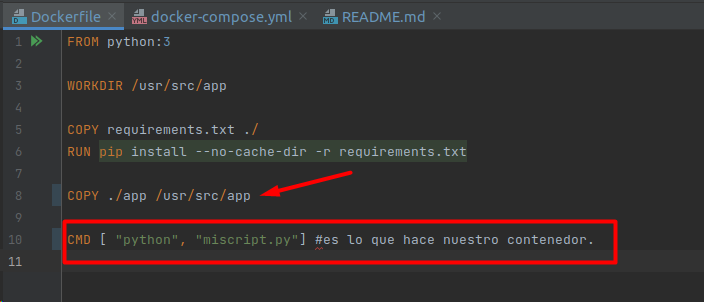
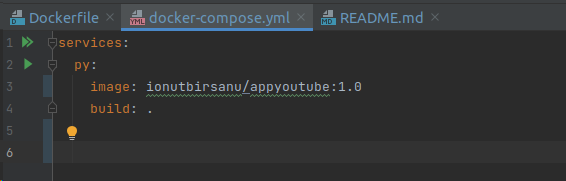
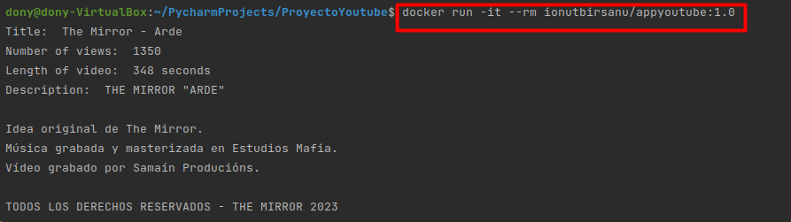
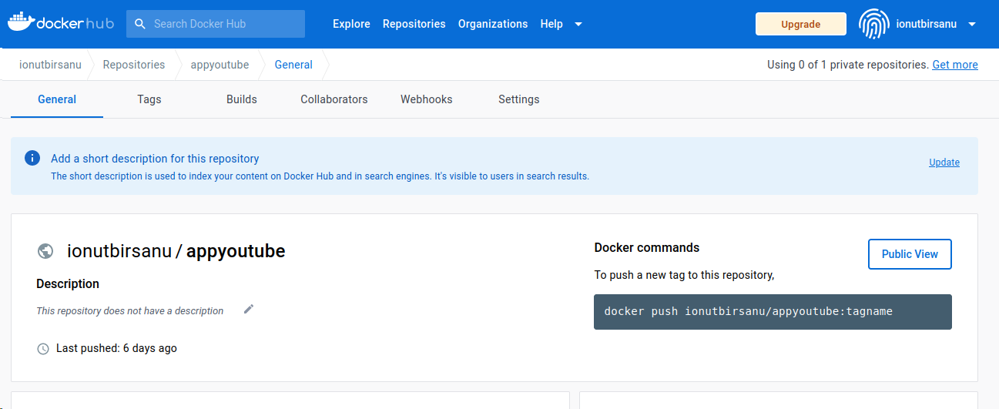
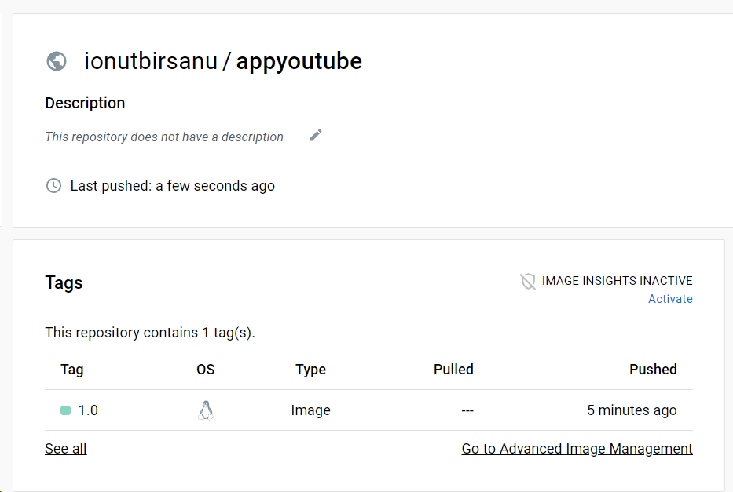

# Proyecto Pytube


En este proyecto vamos a crear un contenedor en el cual vamos a ejecutar un script en Python

El script va a utilizar la librería externa pytube.

## Creación de la imagen personalizada

Para personalizar una imagen de Docker, utilizamos el fichero Dockerfile, en el cual le podemos especificar distintas opciones según la finalidad que buscamos.

Como queremos usar la librería de Pytube, creamos un fichero requirements.txt en el cual añadimos todas las librerías que queramos.

```
pytube==12.1.2 #librería y su versión
PyChromecast 
```

## Creación de script

Ahora, creamos el script en el cual haremos uso de la librería Pytube y con el cual descargaremos el vídeo de Youtube haciendo suso del enlace de este.

```
from pytube import YouTube

yt = YouTube("https://youtu.be/n2qICHoBv48?list=RDn2qICHoBv48")

#Title of video
print("Title: ",yt.title)
#Number of views of video
print("Number of views: ",yt.views)
#Length of the video
print("Length of video: ",yt.length,"seconds")
#Description of video
print("Description: ",yt.description)
#Rating
print("Ratings: ",yt.rating)

yt.streams.filter(progressive=True, file_extension='mp4').order_by('resolution').desc().first().download()

```
Script que descargará el video que le pasemos con el enlace.

### Creación Dockerfile
El Dockerfile sería el siguiente:
``` 
FROM python:3

WORKDIR /usr/src/app

COPY requirements.txt ./
#Nos copia el requeriments en el directorio de trabajo

RUN pip install --no-cache-dir -r requirements.txt #ejecución de la instalación de las librerías que tenemos en requirements.txt.

#Podemos poner los comandos que queramos, apt get o lo que sea.
```
Con el código de arriba, después le tenemos que pasar nosotros el script para que se ejecute.

Otra forma de hacerlo sería la siguiente, en la que el script se ejecuta al levantar el contenedor.

Dockerfile


Docker-compose para la ejecución automática

Donde, en la parte de CMD, le ponemos el script que queremos que se ejecute una vez levantado el contenedor.

Tenemos que tener en cuenta que el script tiene que estar en el mismo directorio.

Una vez tengamos la imagen lista, ejecutamos el comando ` docker build -t ionuttube:1.0 .` para crear la imagen. 


### Prueba de la imagen

Para probar la imagen, ejecutamos el comando `docker run -it --rm appyoutube:1.0`




Al lanzar la imagen, se nos ejecuta el comando que le pusimos en el apartado de CMD en el Dockerfile.

## Creación docker-compose

```
services:
  py:
    image: ionutbirsanu/appyoutube:1.0
    build: .
    volumes:
      - ./app:/usr/src/app

```

La imagen de python la encontramos en docker hub. https://hub.docker.com/_/python/

Ojo, solo podremos ejecutar los scripts que tengamos en el mismo directorio de trabajo dentro del contenedor.


## Subida de la imagen a Docker-hub

Para subir la imagen, primero nos tenemos que crear una cuenta si no disponemos de una.

- Nos logueamos en docker-hub.


- Creamos un nuevo repositorio en el cual subir la imagen.



Le damos un nombre al repositorio y añadimos una descripción. Luego hacemos click en create para crear el repositorio.

Una vez listo, volvemos a la terminal.

Primero tenemos hacer un ` docker login` en el terminal para crear la conexión con nuestra cuenta de docker-hub. Ponemos nuestro usuario y credenciales.


Una vez listo, ejecutamos el siguiente comando para enlazar el repositorio y nuestra imagen local.
`docker tag ionuttube:latest ionutbirsanu:appyoutube`

_Docker tag nombre_imagen:version nombre_usuario:repositorio_

Una vez creado el tag, hacemos el docker push para subir la imagen a nuestro repositorio en docker-hub.

`docker push ionutbirsanu/appyoutube:1.0` (docker push nombre_usuario/repositorio:version)


Otra forma de hacerlo, es al crear la imagen, poner ya nuestro nombre de usuario de docker hub seguido del nombre de la imagen, _Ionuttube_ y el tag, la versión.

` docker build -t ionutbirsanu/appyoutube:1.0 .`

Después, simplemente hacemos el push de la imagen con el comando `docker push ionutbirsanu/ionuttube:1.0`


Imagen subida con éxito.

## Uso de la imagen

Ejecutando el comando `docker search nombre_imagen`, buscamos las imágenes disponibles existentes en docker hub.
Vemos que nos encuentra la imagen que subimos anteriormente.

Para descargar la imagen, ejecutamos `docker run -it --rm ionutbirsanu/appyoutube:1.0`. Si no tenemos la imagen en local, se nos hace el docker pull de forma automática.

Si después del docker run ponemos un comando al final, solo se ejecutará este comando final, y no el de la imagen si la contiene.

